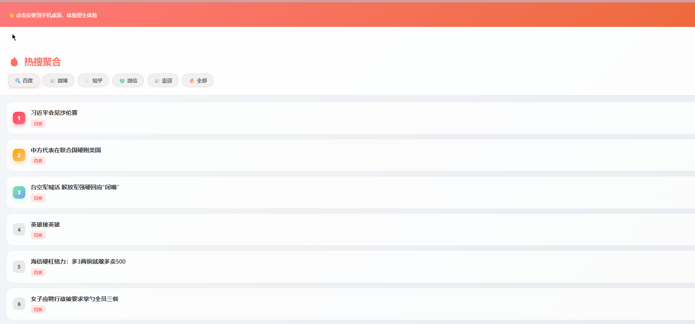

# 热搜聚合

一个简洁的热搜资讯App，聚合多个平台的热搜榜单。

## 功能

- 🔥 支持平台：百度、微博、知乎、微信、澎湃
- 📖 一键查看热搜摘要，无需跳转外部网站
- 🌙 支持白天/黑夜模式
- 📱 可安装到手机桌面作为原生App使用
- 🔄 每次打开自动获取最新数据

## 在线访问

**https://yanyang0226.github.io/hot-search/**

## 截图

## 技术栈

- 纯前端实现，无需后端服务器
- PWA技术，支持离线访问和桌面安装
- 数据来源：tophub.today

## License

MIT